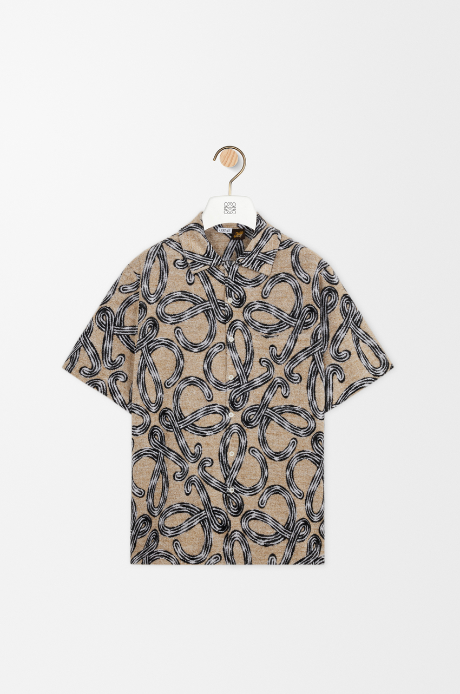
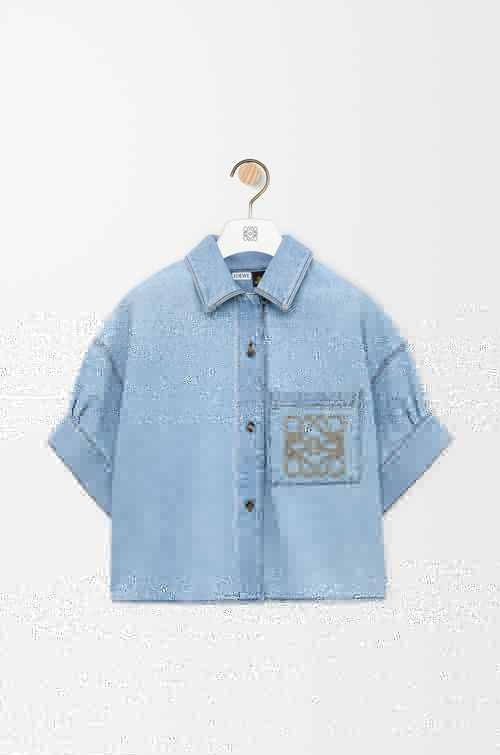

# Modelify AI

<p align="center">
  <strong>AI fashion model generation for modern e-commerce.</strong>
</p>

<p align="center">
  Turn clothing product photos into polished AI model images for storefronts, campaigns, and product listings — without a traditional photoshoot.
</p>

<p align="center">
  <a href="https://modelify.fit"><strong>Try Modelify →</strong></a>
</p>

<p align="center">
  <a href="README.md">English</a> ·
  <a href="README.zh-CN.md">简体中文</a>
</p>

<p align="center">
  
  
  
</p>

---

## Example Results

Real examples from Modelify workflows, showing product inputs and generated fashion imagery.

### Multi-angle generation

<p align="center">
  
</p>

<p align="center">
  <sub>Front, 45°, side, and back views for fashion product presentation.</sub>
</p>

### Source product images

<table>
  <tr>
    <td align="center" width="50%">
      
      <br />
      <sub><b>Patterned shirt input</b></sub>
    </td>
    <td align="center" width="50%">
      
      <br />
      <sub><b>Denim shirt input</b></sub>
    </td>
  </tr>
</table>

### Lifestyle & campaign outputs

<p align="center">
  
</p>

<p align="center">
  
</p>

<p align="center">
  <sub>Generated lifestyle, catalog, and campaign-style fashion imagery.</sub>
</p>

## Free Fashion AI Resources

If you're working on AI fashion photography or e-commerce imagery, start here:

- **[Fashion E-commerce AI Cookbook](cookbook/README.md)** — practical workflows and best practices
- **[Source Image Preparation](cookbook/source-image-preparation.md)** — how to prepare product photos for better results
- **[Fashion Prompt Library](cookbook/prompt-library.md)** — reusable prompts for catalog, editorial, streetwear, activewear and more
- **[Shopify Image Workflow](cookbook/shopify-workflow.md)** — a repeatable SKU-to-storefront workflow
- **[Troubleshooting Guide](cookbook/troubleshooting.md)** — common garment, color, logo and consistency problems

> ⭐ If these resources are useful, star the repository to keep it handy and follow future additions.

## What is Modelify?

Modelify is an AI product photography platform built for fashion e-commerce.

It helps sellers and brands transform clothing product images into realistic model photography that can be used across online stores, product listings, campaigns, and social content.

### What you can do

- Generate AI fashion model images from clothing product photos
- Choose different model styles and visual directions
- Create e-commerce-ready product imagery
- Reduce dependence on traditional photoshoots
- Build faster content workflows for fashion products

🌐 **Product:** https://modelify.fit

## Why this repository exists

Modelify is a commercial SaaS product with a public project surface.

This repository is the public home for useful fashion-AI resources, product documentation, architecture overviews, integration examples, API direction, roadmap visibility, and community feedback.

> **Important:** this is not a full source-code mirror of the production Modelify platform.

The production SaaS, generation workers, AI provider routing, prompts and tuning, billing, queue strategy, internal APIs, and other proprietary systems remain private.

## How Modelify works

```text
Product Image
     │
     ▼
Upload to Modelify
     │
     ▼
Choose Model / Style
     │
     ▼
AI Generation
     │
     ▼
E-commerce Ready Image
```

Read the [architecture overview](docs/architecture.md) for the platform-level view.

## API & integrations

A public developer API is part of the Modelify ecosystem direction.

The current repository documents the intended integration boundary without exposing or promising unsupported production endpoints.

- [API overview](docs/api-overview.md)
- [cURL integration example](examples/curl-example.md)

Official SDKs are **not** required for the first public phase. We prefer to build and maintain SDKs when real external demand makes them useful.

## Roadmap

Current direction includes better generation quality and reliability, public API access, webhook-based workflows, Shopify improvements, WooCommerce integration, better batch automation, and SDKs when external demand justifies them.

See [ROADMAP.md](ROADMAP.md).

## Open source boundary

**Public:** documentation, cookbook resources, architecture overview, integration guidance, API examples, roadmap, and community contributions.

**Private:** generation workers, AI provider routing, prompting and tuning, image preprocessing heuristics, queue/concurrency implementation, retry/fallback strategy, cost optimization, billing/credits, production database design, and internal administration systems.

## Security & contributing

- [Security policy](SECURITY.md)
- [Contributing guide](CONTRIBUTING.md)

## License

Unless stated otherwise, materials in this public repository are available under the [Apache License 2.0](LICENSE).

The Modelify hosted service, proprietary backend systems, generation infrastructure, provider configuration, and brand assets may be governed by separate terms and are not automatically covered by this repository's license.

---

<p align="center">
  Built for fashion e-commerce teams that want better product imagery with less operational overhead.
</p>

<p align="center">
  <a href="https://modelify.fit"><strong>modelify.fit</strong></a>
</p>
